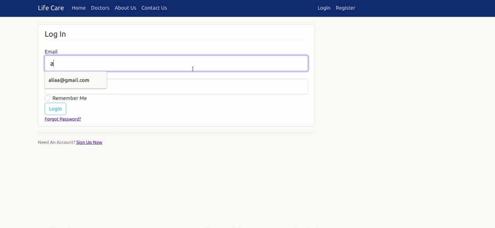

# Hospital Information System

## *About the system*

1. different users can use the application and each category can do different stuff (eg. Doctors, Patients, Admin, ..etc)

- Each patient can see his/her profile 
  
  
-  Each doctor can see his/her reserved appointments
  

-  Admin can see all the doctors
  


2. The application uses static files, file uploads (eg. patients scans)
  


3. user sign up and sign in forms
  
  


4. Synchronize the application with google calender or any calender for doctors.
  
  


5. contact us form for any complains or special request
  
  


6. statistical analysis for the admin entry
  
  


### PIP Dependencies

- Install dependencies by naviging to the project directory and running:
  ```
    pip install -r requirements.txt
  ```
  This will install all of the required packages we selected within the requirements.txt file.
